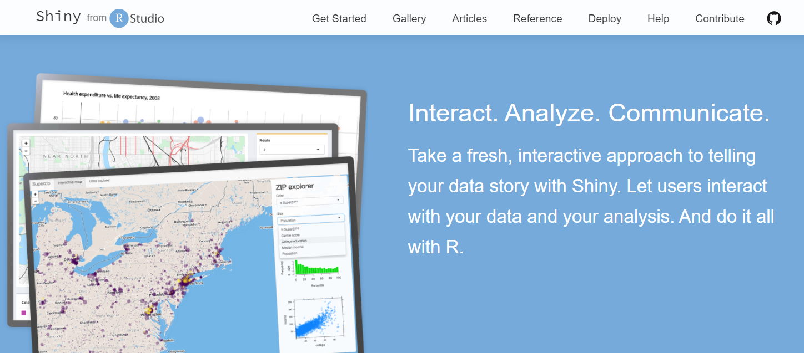
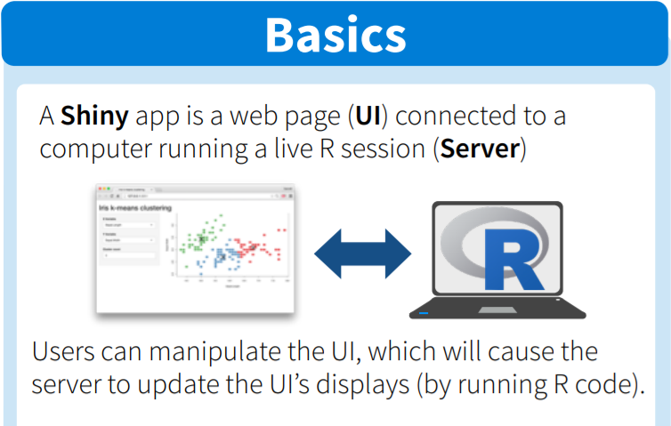
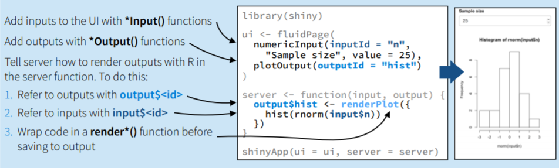
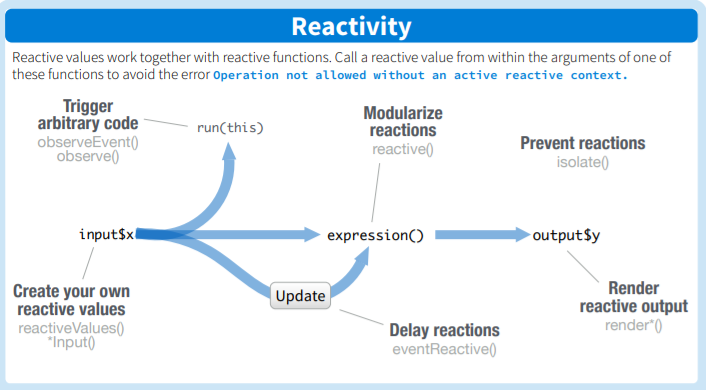
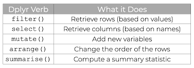

```{r setup, include=FALSE}
knitr::opts_chunk$set(echo = TRUE)
library(knitr)
library(tidyverse)
```

## Background

 * Mike Kleinsasser, MS in Statistics
 
 * Staff R programmer focused on R packages

 * Aid students and faculty in R package development/maintenance 
 
 * Typically one of two scenarios:
 
 * You develop a set of statistical methods for R
   - I help package, test, disseminate the code
   
 * You've developed a complete R package
   - I help ensure package meets standards and advise on package structure
   
## Background (continued)

 * Maintain a catalog of statistical software on our department website
 
 * Host a number of Shiny apps for members of the department (free for students and faculty)
 
 * Workshops on various useful R packages and on R package development (dates posted in the department events emails)
 
 * Please feel free to email me at mkleinsa@umich.edu if you would like help developing an R package or are interested in a workshop topic
 
## Up and coming...

 * Thursday, don't miss Command Line Linux with Dan Barker
 
 * Tuesday, Feb 9 - Package development
 
 * Thursday, Feb 11 - Getting Git
 
## What will we be covering today?

 * Basic Shiny concepts (why Shiny?, general architecture, analyze example, work example)
 
 * Learn what UI, server, input, output mean; how they fit together
 
 * Make an app reactive (meaning the app seems live)
 
 * Leave with an exciting example to make your own

## Shiny, what is it?

 * Shiny - interactive web app framework for R
 
 * Interactive web apps straight from R. Host apps on webpage, embed them in R Markdown, build dashboards

{width=100%}

## Shiny, Basics: UI and Server



## Shiny
 
 * Implements a "reactive" binding between inputs and outputs for responsive user experience
 
 * Extensive set of pre-built widgets for assembling apps with very little effort
 
 * Combined, these provide a fairly intuitive, fast platform for making apps
 
 * Let's illustrate key concepts with an example

{width=40%}

## Building an app (design phase)

 * Let's say we want a simple app that generates a random normal sample of size n and plots a histogram of the sample
 
 * Input the sample size of the random normal sample (numeric input)
 
 * Generate a histogram of n random normal draws (hist(rnorm(n))) in Server
 
 * Print the plot back to the UI

## Building an app

 * A first example (left pane is an R script, right pane is the UI):
 
 * We'll break this app down in the following slides, and study it as a whole

{width=105%}

## Basic app architecture

 * The code in gray text provides the basic architecture of every app (provided with the repository for our worked example)
 
 * UI is a fluid page (by itself produces a blank HTML page)
 
 * Server is an R function of input, output (lists)
 
{width=105%}

## UI

 * R functions that produce HTML code (do not need to know HTML)
 
 * Look up the Shiny names for UI objects, such as text box, plot

{width=105%}

## Server

 * R function that produces results based on inputs
 
 * Two arguments: input, output

{width=105%}

## Input

 * List which contains all app inputs
 
 * Each input named with a unique Id

{width=105%}

## Output

 * List which contains all app outputs
 
 * Each output named with a unique Id

{width=105%}

## Building an app

{width=105%}

 * "*" = the name of any type. Every __Output() function corresponds to one render_() function 
 
 * UI: single input, single output; Server: Reacts to the single input to generate the only output
 
 * How does the app achieve the live quality?

## Reactivity

 * Reactive programming model - state of application responds to change in real time
 


## Reactivity
 
 * Reactivity comes in three varieties: reactive sources, reactive conductors,
 reactive endpoints
 


## Reactivity
 
 * Reactive source: user input through a browser interface, e.g., dropdown menu selection
 


## Reactivity
 
 * Reactive endpoint: result that appears in user's browser window, e.g., printed text
 

 
## Reactivity (continued)
 
 * The `input` object carries (or stores) the reactive source objects as a list
 
 * The `output` stores the reactive endpoint objects as a list
 
 * ALL inputs from the user live in `input`
 
 * ALL output you program into the server lives in `output`
 
{width=50%}

## Reactivity (continued)

 * Our example will focus on `observeEvent()` - Respond to "event-like" reactive inputs, values, and expressions


## First Shiny App

 * Let's make an app out of dplyr
 
 * In dplyr, five verbs for solving data manipulation problems
 
 * We'll implement some easy verbs, leave the rest as an exercise
 

{width=60%}

## The five verbs

 * The five verbs



 * Use any sequence of these verbs to accomplish some data manipulation task
 
 * Challenging but excellent example to expand your Shiny and general R skills

 * Download the repo at: github.com/umich-biostatistics

